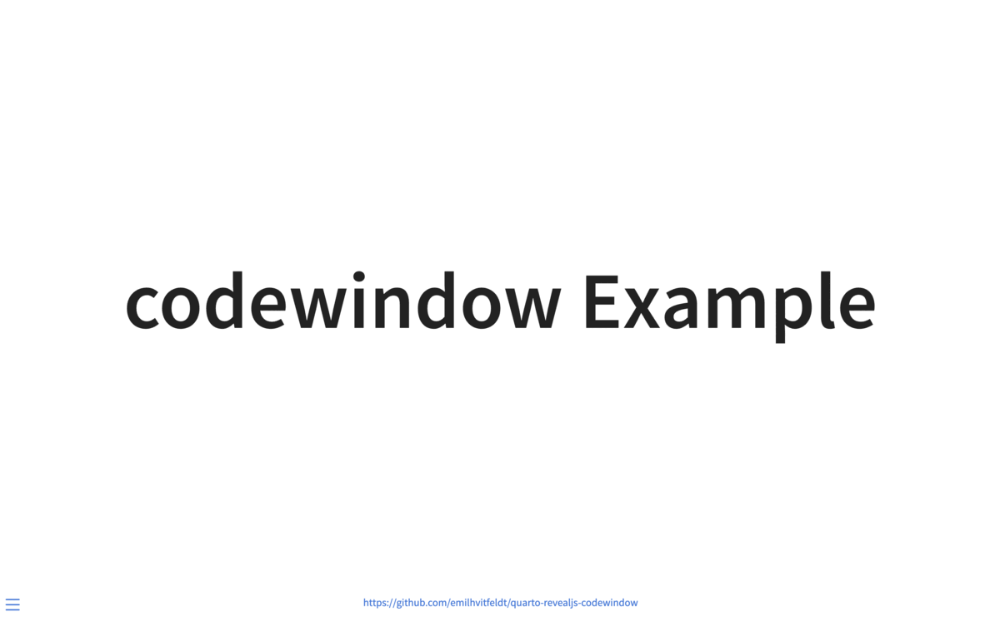

# codewindow Extension For Quarto

Add styled codeblock windows for code.



## Installing

```bash
quarto add emilhvitfeldt/quarto-revealjs-codewindow
```

This will install the extension under the `_extensions` subdirectory.
If you're using version control, you will want to check in this directory.

Once an extension has been added, you can use the Reveal plugin by adding it to the `reveal-plugins` key. For example:

````` markdown
---
title: "My Presentation"
format: revealjs
revealjs-plugins:
  - codewindow
---
`````

## Using

Adding a `::: {.codewindow}` fenced div around any code chunk will turn the output into a `codewindow`. The file tab is enabled by adding plain text before the code chunk.

Adding the one of the following classes adds an icon in the file tab. File an issue to have more icons added to this list

- `.r`
- `.py`
- `.js`
- `.quarto`
- `.html`
- `.css`
- `.sass`

The `width` argument can be used directly in the code fence.

## Example

Here is the source code for a minimal example: [example.qmd](example.qmd).

