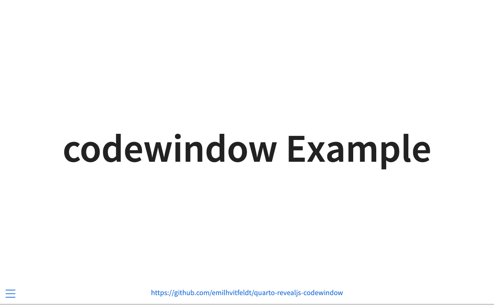

# codewindow Extension For Quarto

Add styled codeblock windows for code.



## Installing

```bash
quarto add emilhvitfeldt/quarto-revealjs-codewindow
```

This will install the extension under the `_extensions` subdirectory.
If you're using version control, you will want to check in this directory.

Once an extension has been added, you can use the Reveal plugin by adding it to the `reveal-plugins` key. For example:

````` markdown
---
title: "My Presentation"
format: revealjs
revealjs-plugins:
  - codewindow
---
`````

## Using

Adding a `::: {.codewindow}` fenced div around any code chunk will turn the output into a `codewindow`. The file tab is enabled by adding plain text before the code chunk.

Adding the one of the following classes adds an icon in the file tab. File an issue to have more icons added to this list

Markup, styling and data formats:

- `.html`
- `.css`
- `.sass` (or `.scss`)
- `.markdown` (or `.md`)
- `.yaml` (or `.yml`)
- `.json`
- `.quarto` (or `.qmd`)
- `.sql`

Shells and tooling:

- `.terminal` (or `.sh`, `.zsh`, `.shell`, `.console`)
- `.bash`
- `.git`
- `.nextflow`

Statistical and scientific languages:

- `.r`
- `.rmd` (or `.rmarkdown`)
- `.python` (or `.py`)
- `.julia` (or `.jl`)
- `.stan`
- `.mplus`
- `.sas`
- `.spss`
- `.stata`
- `.matlab`
- `.cpp`
- `.fortran` (or `.f90`)

General-purpose languages:

- `.js` (or `.javascript`)
- `.typescript` (or `.ts`)
- `.rust`
- `.go` (or `.golang`)

The `width` argument can be used directly in the code fence.

## Colors

The colors of a single window can be set with these code fence arguments:

- `bg`: the window background
- `header-bg`: the header bar behind the file tabs
- `tab-bg`: inactive file tabs (multi-tab windows)
- `tab-active-bg`: the active file tab (defaults to `bg`)
- `color`: plain text inside the window
- `shadow-color`: the drop shadow

````` markdown
::: {.codewindow .sass bg="#fdf6e3" header-bg="#eee8d5" shadow-color="#93a1a1"}
styles.scss
```{{scss}}
.pink {
  color: pink;
}
```
:::
`````

Adding the `.codewindow-dark` class gives a dark window, with the syntax highlighting remapped to a dark palette:

````` markdown
::: {.codewindow .sass .codewindow-dark}
```{{scss}}
.pink {
  color: pink;
}
```
:::
`````

Each argument is backed by a CSS custom property, so all windows in a deck can be restyled at once from your own stylesheet:

````` css
.reveal {
  --codewindow-bg: #fdf6e3;
  --codewindow-header-bg: #eee8d5;
  --codewindow-tab-bg: #d9d2ba;
  --codewindow-tab-active-bg: #fdf6e3;
  --codewindow-color: #073642;
  --codewindow-shadow-color: #93a1a1;
}
`````

## Multiple tabs

A single `codewindow` can show several file tabs. Wrap one or more `.editor` divs inside the `.codewindow` div, one per tab. Each `.editor` takes the same language classes for its icon and either a `name="..."` attribute or leading plain text for its filename.

- The first tab is shown by default. Add `.active` to a different `.editor` to start on that one instead.
- Add `.fragment` to an `.editor` to focus its tab as the slide advances (and step back when reversing).

````` markdown
:::: {.codewindow}
::: {.editor .r name="00-load.R"}
```r
data <- read.csv("my-data.csv")
```
:::

::: {.editor .r .fragment name="01-clean.R"}
```r
library(dplyr)
data <- filter(data, x > 0)
```
:::
::::
`````

## Example

Here is the source code for a minimal example: [example.qmd](example.qmd).

